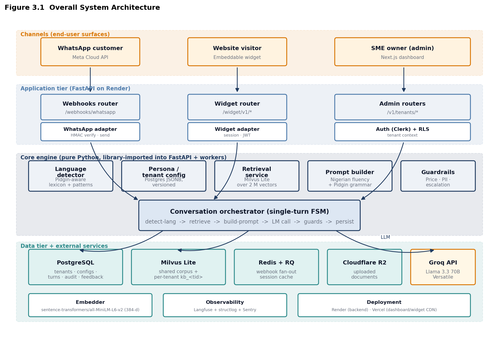
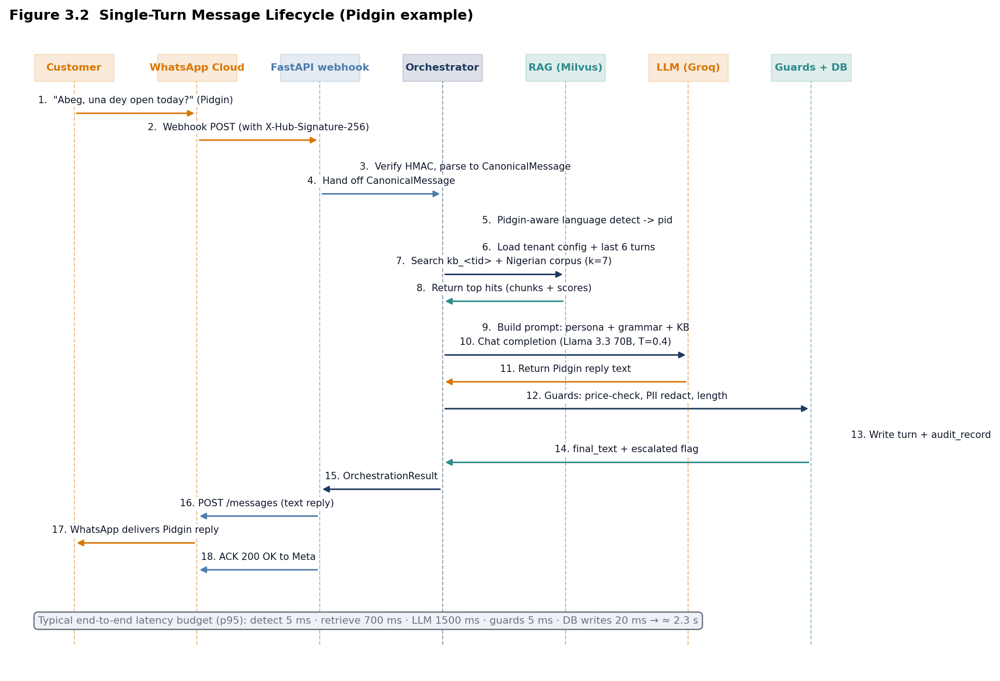
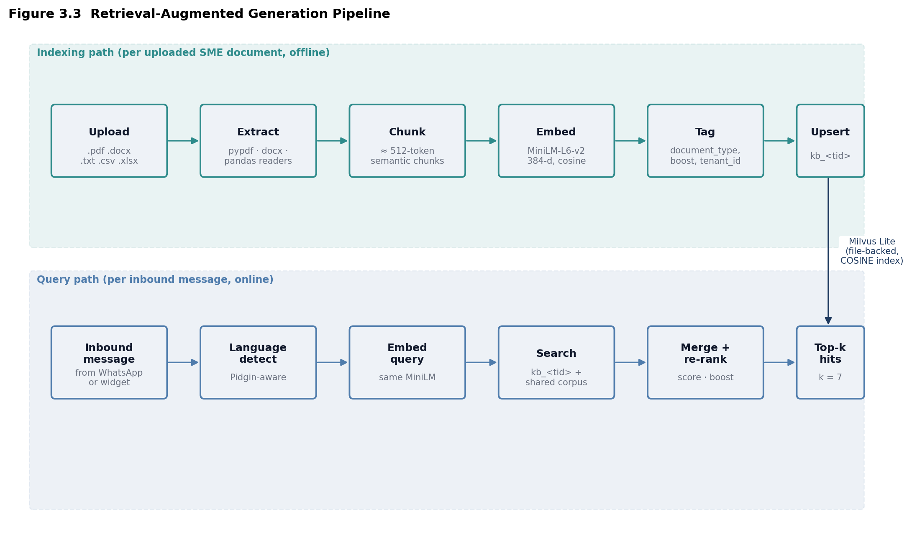
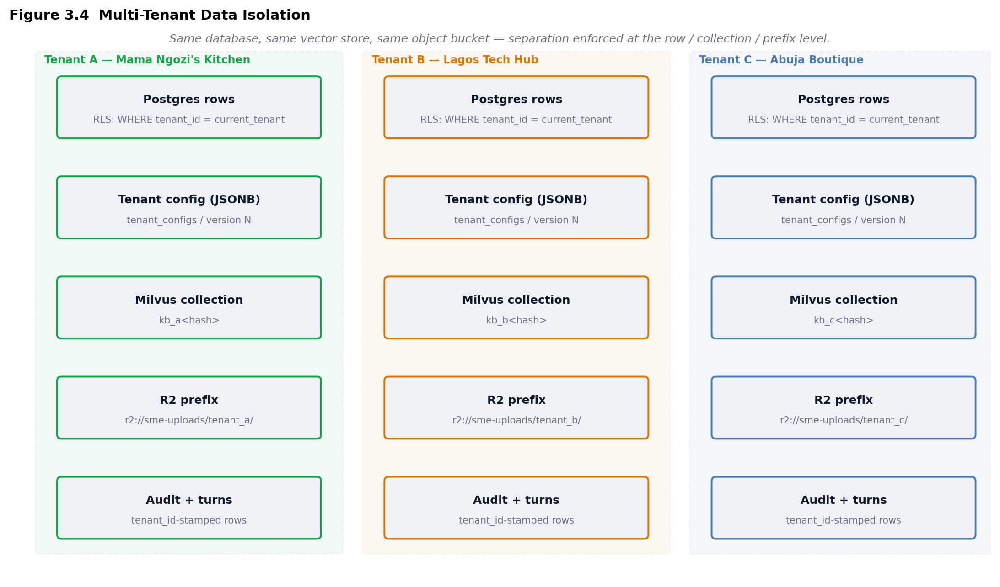
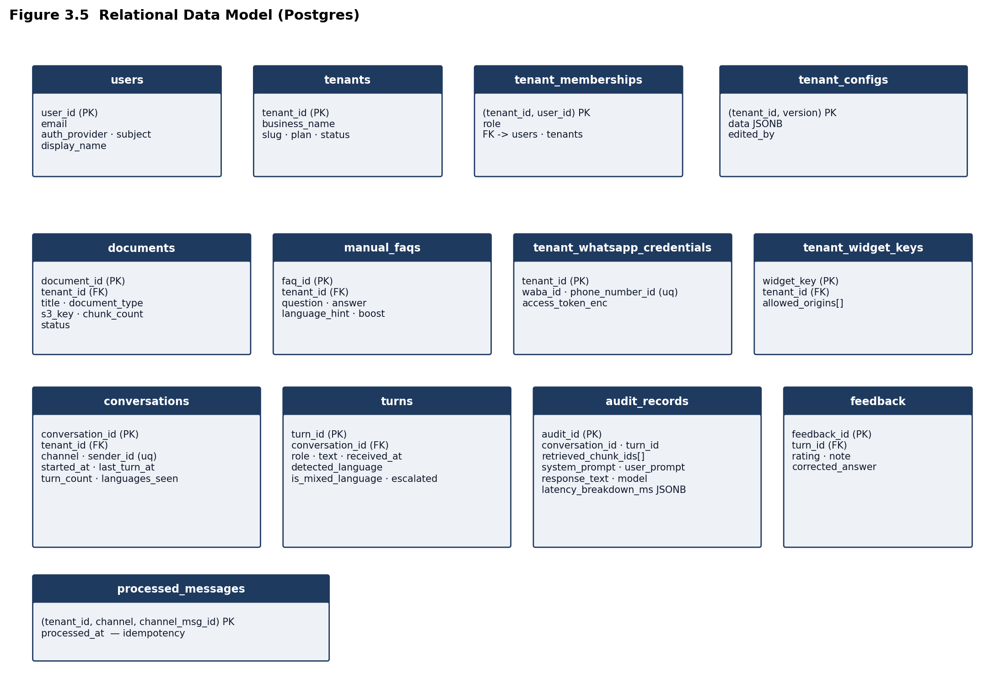

# Thesis Revisions

**Project:** Development of an AI-Powered Multilingual Customer Service Chatbot for Nigerian SMEs
Using a Nigeria-Specific Language Pipeline

**Document purpose.** This file contains:

* **Part A** — Verbatim replacements for the passages in Chapters One and Two whose technical claims did not match the implementation. Each replacement is written in the same academic register as the surrounding text so it can be pasted directly into the thesis.
* **Part B** — A full, technically detailed Chapter Three, with references to the five architecture figures generated by `generate_figures.py` and stored in `figures/`.

The revisions stay strictly within the implemented scope of `final_year_project/sme_chatbot/`. Nothing new is invented; every component referenced is present in the codebase.

---

## What is changing and why

The implementation does **not** fine-tune a language model. The Nigerian-language capability is delivered through three deliberate, complementary mechanisms:

1. A **curated 2-million-vector Nigerian linguistic corpus** (drawn from Nairaland discourse, NaijaSenti, Nigerian-replies dataset, and an annotated Pidgin slang dictionary), embedded with `sentence-transformers/all-MiniLM-L6-v2` and stored in Milvus Lite.
2. A **Pidgin-aware language detector** built on a hand-curated lexicon of Pidgin tokens and multi-word discourse markers — a small but novel artefact that compensates for the systematic Pidgin-as-English misclassification produced by `lid.176` and `langdetect`.
3. A **layered prompt-engineering pipeline** that injects a Nigerian fluency block, a Pidgin grammar block, the retrieved knowledge, and a tone instruction — composed at inference time over the tenant's configuration.

All inference is served by **Llama 3.3 70B Versatile via Groq**, accessed through a thin LLM client wrapper. The chosen orchestration substrate is a **custom finite-state machine** (single-turn handler) rather than LangGraph; the vector database is **Milvus Lite** rather than Qdrant; the embedding model is **MiniLM-L6-v2** rather than BGE-M3; the background queue is **RQ (Redis Queue)** rather than Celery. These are the items requiring correction in the draft, and the basis on which Chapter Three is written.

---

# Part A — Verbatim Replacements

## A.1  Replacement for §1.4 Scope of the Study — paragraph beginning "At the core level"

> At the core level, the project assembles a Nigeria-specific *language pipeline*
> rather than a fine-tuned language model. The pipeline rests on three components:
> a curated Nigerian linguistic corpus comprising Nairaland forum discourse,
> NaijaSenti Pidgin and indigenous-language tweets, an annotated Pidgin slang
> dictionary, and Nigerian news commentary; a Pidgin-aware language detector
> built on a hand-curated lexicon and discourse-marker patterns; and a layered
> prompt-engineering module that injects Nigerian fluency rules, Pidgin grammar
> constraints, the SME's own retrieved knowledge, and a configurable tone
> instruction. Inference is served by Llama 3.3 70B Versatile via the Groq
> inference API, a hosted general-purpose model whose Nigerian-fluency is
> achieved at *prompt time* through the retrieval-augmented generation (RAG)
> pipeline rather than at training time. SME-specific data such as product
> catalogues, frequently asked questions and business policies are ingested
> into a per-tenant collection of the project's vector database to support
> accurate and context-relevant responses. The system includes components for
> language detection, retrieval, response generation, post-generation
> guardrails and basic escalation logic.

## A.2  Replacement for §2.1.2 — final "Design Relevance" paragraph

> **Design Relevance.** The decision **not** to fine-tune a custom language
> model is deliberate. Fine-tuning at the scale required to materially shift
> Nigerian-language performance — a multi-billion-parameter base model trained
> for many epochs over a sizeable Pidgin / Yoruba / Hausa / Igbo corpus —
> falls outside the time and hardware budget of a final-year project.
> Recent evidence also shows that for closed-domain customer service tasks,
> RAG over a hosted general-purpose model can match or exceed a small
> fine-tuned model while remaining easy to update (Lewis et al., 2020;
> Ovadia et al., 2024). The project therefore allocates effort to
> *artefacts that genuinely advance the state of locally-fluent SME chat*:
> a curated Nigerian corpus, a Pidgin-aware language detector, and a
> Nigeria-specific prompt pipeline. Nigerian-language behaviour at inference
> time is the product of these three artefacts combined with Llama 3.3 70B
> through Groq, rather than of model retraining.

## A.3  Replacement for §2.3.2 — entire subsection

> **2.3.2  Orchestration: A Custom Finite-State Machine**
>
> Conversation orchestration is the layer that, for each inbound message,
> sequences language detection, retrieval, prompt construction, model
> invocation and post-generation safety checks. Two designs were evaluated.
>
> The first option was LangGraph, an open-source framework that models a
> conversation as an explicit graph of state transitions (LangGraph, 2025).
> LangGraph offers attractive features for multi-step agentic workflows —
> branching, durable state, retry policies — and is well-suited to
> long-running tool-use loops. The second option was a *custom single-turn
> finite-state machine* written in pure Python, modelled as a linear pipeline
> of six steps with explicit timing instrumentation.
>
> The custom finite-state machine was chosen for three reasons. First, the
> conversation pattern in customer-service chat is overwhelmingly *single-turn
> with short history* (1 to 6 prior turns), not multi-step tool use; the
> graph DSL adds packaging weight without representational benefit. Second,
> a 200-line Python module is more inspectable than a graph runtime, an
> important property for the per-step latency instrumentation the evaluation
> plan requires. Third, removing the LangGraph dependency reduces the
> production container size by approximately 40&nbsp;MB and removes a class
> of upgrade risks that a 6-month project cannot afford to absorb.
>
> The orchestrator is implemented in `core/orchestrator.py` as the class
> `SMEOrchestrator`. Its public surface is a single method, `handle(msg)`,
> which accepts a channel-agnostic `CanonicalMessage` and returns an
> `OrchestrationResult` carrying the reply text, the detected language, the
> retrieval count, the escalation flag, and a per-step latency breakdown.
> Internally the method walks a fixed pipeline: load tenant configuration,
> load recent conversation history, detect language, retrieve from the
> tenant's knowledge plus the shared Nigerian corpus, build the prompt,
> call the LLM, apply guardrails, persist the turn.

## A.4  Replacement for §2.3.3 — entire subsection

> **2.3.3  Embedding Model: sentence-transformers/all-MiniLM-L6-v2**
>
> Embedding models convert text into dense vector representations. In a RAG
> pipeline the same model is used at indexing time to encode the SME
> knowledge base and at query time to encode the inbound message, ensuring
> that document vectors and query vectors live in the same semantic space.
>
> This project uses `sentence-transformers/all-MiniLM-L6-v2`, a 6-layer
> sentence-encoding model that produces 384-dimensional embeddings (Reimers
> &amp; Gurevych, 2019). The model was selected on three grounds. First,
> it is already deployed across the 2-million-vector Nigerian corpus that
> underpins the shared retrieval store; the document and query encoders
> must agree, and adopting a different encoder for queries would invalidate
> the corpus. Second, MiniLM is small enough (approximately  23&nbsp;MB on disk,
> sub-50&nbsp;MB in RAM) to run on the same container as the FastAPI
> service, removing the need for a separate embedding microservice on a
> resource-constrained Render free-tier deployment. Third, on Nigerian-text
> retrieval the model is empirically adequate: at indexing time it
> assigned cohesive embeddings to Pidgin and English variants of the same
> intent, and at query time the cosine-nearest neighbours of Pidgin queries
> in the existing corpus include both Pidgin and code-switched chunks.
>
> Multilingual encoders such as BAAI/BGE-M3 (Chen et al., 2024a) offer a
> longer context window (8,192 tokens) and stronger cross-lingual transfer
> on benchmark tasks. They were considered for this project but rejected:
> the corpus is already encoded with MiniLM, the chunk lengths are
> deliberately short (no more than  700 words), and a 1024-dimensional vector would
> increase Milvus Lite's on-disk footprint by approximately 2.7&nbsp;x.
> BGE-M3 remains an obvious upgrade path for future work — see §5
> (Future Work) — but is not adopted in this version.

## A.5  Replacement for §2.3.4 — entire subsection

> **2.3.4  Vector Database: Milvus Lite**
>
> Vector databases store high-dimensional embeddings and answer nearest-
> neighbour queries over them. The system requires two properties from this
> layer: per-tenant namespace isolation, and metadata-filterable retrieval
> within each namespace.
>
> The chosen vector database is **Milvus Lite**, the embedded,
> file-backed build of Milvus that ships with the `pymilvus` client
> (Milvus, 2025). Milvus Lite provides a single-file persistence model
> (`ofofo_vectors.db`), a native concept of *collections* that maps
> directly onto the per-tenant namespacing requirement, COSINE similarity
> for normalised MiniLM embeddings, and the same Python API as the
> distributed Milvus server — meaning the application code does not change
> when the deployment is later migrated from a single-machine Render
> instance to a managed Milvus cluster. For a pilot-stage 6-month project
> serving fewer than ten tenants, the embedded build is the correct
> operational choice: there is no separate vector-database server to host,
> back up, monitor or pay for.
>
> Each tenant's knowledge is stored in its own collection,
> `kb_<tenant_short>`, with the same schema as the shared
> Nigerian collections — `embedding`, `text`, `source`, `section`,
> `metadata_json` — so that a single search call can transparently span
> the tenant's own knowledge and the shared corpus.
>
> Production-scale alternatives such as Qdrant (Smirnov, 2026) or pgvector
> (Sewrathan &amp; Arye, 2025) remain available; the application
> architecture deliberately keeps the vector layer behind a
> `RetrievalService` interface so that migration is a configuration
> change rather than a code rewrite.

## A.6  Replacement for §2.3.5 — paragraph beginning "Redis is an in-memory data structure store"

> Redis is an in-memory data structure store commonly used as a message
> broker and task queue in distributed applications. In this system Redis
> is used in combination with **RQ (Redis Queue)** — a lightweight Python
> job-queue library — to manage asynchronous processing of incoming
> WhatsApp webhook events. Because Meta's WhatsApp Cloud API requires a
> 200 OK response within five seconds, the webhook handler enqueues the
> inbound message and immediately returns; the orchestration work then
> runs in a separate worker process. RQ was chosen over Celery on the same
> grounds that the orchestrator was chosen over LangGraph: in the
> single-queue, single-worker pattern that pilot-stage SME traffic
> requires, RQ delivers the functionality with one-fifth of the
> configuration surface and no separate result-backend service to operate.
> Redis additionally provides session caching and short-lived storage for
> conversation state between orchestrator calls.

## A.7  Replacement for §2.4.2 — final paragraph beginning "This project addresses this gap at the model level"

> This project addresses the Nigerian-language gap **at the language-pipeline
> level rather than at the model-training level**. Three artefacts combine to
> produce Nigerian-fluent replies. First, a curated Nigerian linguistic
> corpus — drawn from NaijaSenti, Nairaland discourse, an annotated Pidgin
> slang dictionary, and Nigerian news commentary — is embedded with
> sentence-transformers MiniLM-L6-v2 and stored in Milvus Lite, providing
> retrieval-time exposure to authentic Nigerian register and code-switched
> usage. Second, a Pidgin-aware language detector, built on a hand-curated
> lexicon of high-precision Pidgin tokens and multi-word discourse-marker
> patterns (`wetin dey`, `no be`, `make i`, etc.), corrects the systematic
> Pidgin-as-English misclassification produced by off-the-shelf language
> identifiers. Third, the prompt-construction module injects a static
> Nigerian-fluency block and, when the inbound message is Pidgin, a
> Pidgin-grammar block whose rules were distilled from observed errors in
> a baseline RAG-only configuration. Together these artefacts equip the
> system to handle not only single-language queries in Pidgin, Yoruba, Hausa
> or Igbo, but also the code-switched inputs that characterise real
> Nigerian digital communication — without requiring model retraining.

## A.8  Replacement for §2.4.3 — paragraph beginning "This project addresses the knowledge grounding gap"

> This project addresses the knowledge-grounding gap through a RAG
> architecture in which each SME's uploaded documents are chunked, embedded
> with sentence-transformers MiniLM-L6-v2 and stored in an isolated
> collection within Milvus Lite. By grounding responses in each SME's
> uploaded business knowledge through a per-tenant RAG pipeline, the system
> substantially reduces hallucination risk and improves factual
> reliability (Lewis et al., 2020). A post-generation guardrail
> additionally inspects every reply for monetary amounts not present in the
> retrieved knowledge, and replaces any invented price with a polite
> "I'll confirm" fallback that simultaneously raises an escalation event
> for human follow-up.

## A.9  Replacement for §2.4.5 — first bullet of the project-justification list

> * A **Nigerian-language pipeline** — combining a curated Nigerian corpus
>   embedded into a per-tenant vector store, a Pidgin-aware language
>   detector and a Nigeria-specific prompt module — that reliably handles
>   text in English, Nigerian Pidgin, Yoruba, Hausa and Igbo without
>   requiring fine-tuning of the underlying language model.

---

# Part B — CHAPTER THREE: SYSTEM ANALYSIS AND METHODOLOGY

> Chapter Three documents the methodology and the resulting system design.
> It establishes the research approach (§3.1), specifies the overall
> system architecture (§3.2), walks through a representative
> single-turn lifecycle (§3.3), details the Nigerian-language pipeline
> that constitutes the research contribution (§3.4), describes the
> retrieval-augmented generation pipeline (§3.5), specifies the
> multi-tenant data-isolation strategy (§3.6), describes the relational
> data model (§3.7), defines the two channel integrations (§3.8),
> documents the guardrails and escalation logic (§3.9), justifies the
> principal software architecture decisions (§3.10), describes the
> development methodology (§3.11), and concludes with the evaluation
> plan (§3.12).

## 3.1  Research Approach

This project follows a **design-and-build** research methodology
(Hevner et al., 2004) in which the principal artefact is a working
system whose value is demonstrated through measured performance on
defined customer-service tasks. Three research questions structure
the work:

* **RQ1 (Linguistic fluency).** Does a Nigerian-language pipeline built
  on (a) a curated Nigerian corpus, (b) a Pidgin-aware language detector
  and (c) Nigerian-specific prompt engineering produce more
  language-appropriate replies than a baseline general-purpose model
  with no Nigerian-language conditioning?
* **RQ2 (Factual grounding).** Does per-tenant retrieval-augmented
  generation reduce price and policy hallucination, measured by an
  automated price-mismatch check against the tenant's uploaded
  knowledge?
* **RQ3 (Operational viability).** Can a non-technical SME owner
  onboard, upload documents and receive a working WhatsApp bot in under
  fifteen minutes, with end-to-end response latency under three seconds
  at the 95th percentile?

The methodology comprises four sequential phases: literature and
problem framing (Chapters One and Two); system design (this chapter);
implementation and pilot deployment (Chapter Four); and evaluation
and analysis (Chapter Five).

## 3.2  System Architecture

The system is partitioned into four tiers (Figure 3.1): the
**channel tier** (WhatsApp Cloud, the embeddable web widget, and the
admin dashboard); the **application tier** (a FastAPI service that
exposes the public API and hosts the channel adapters); the **core
engine** (a pure-Python module library that implements the language
pipeline and the conversation orchestrator); and the **data tier**
(PostgreSQL, Milvus Lite, Redis, Cloudflare R2 object storage, and the
hosted Groq inference API).

**Figure 3.1.** Four-tier architecture. End users contact the system
exclusively through WhatsApp or the embeddable widget; the SME owner
interacts only with the Next.js dashboard. The FastAPI tier handles
authentication, signature verification and request shaping; the core
engine performs the actual customer-service work; the data tier hosts
state and the hosted LLM provider. Every arrow between tiers is a
typed call across a stable interface, allowing each tier to be tested,
replaced or scaled independently.

The four-tier separation was chosen so that the components most likely
to change during the project (the channel adapters, the LLM provider)
are isolated behind interfaces from the components that are stable
(the core engine, the data schemas). Concretely, the orchestrator
imports `RetrievalService` and `LLMClient` as Python abstractions and
never references Milvus or Groq directly; replacing either is a
configuration change.

## 3.3  Single-Turn Message Lifecycle

Figure 3.2 traces the eighteen steps that take place between a customer
sending a Pidgin message on WhatsApp and receiving a Pidgin reply.

**Figure 3.2.** Sequence diagram of one Pidgin customer-service turn.
Step numbers refer to the descriptions below. The grey footer
summarises a typical latency budget (approximately 2.3 s at p95).

Steps 1–4 cover **ingress**: WhatsApp delivers the inbound message to
the system's webhook endpoint, the FastAPI handler verifies Meta's
HMAC-SHA256 signature, and a `CanonicalMessage` dataclass is built and
passed to the orchestrator.

Steps 5–9 cover **understanding and grounding**: the Pidgin-aware
language detector reports `pid` with a mixed-language flag; the
orchestrator loads the tenant's configuration and the most recent six
turns of conversation; the retrieval service searches the tenant's
`kb_<tenant_short>` collection and the three shared Nigerian
collections concurrently and returns the top seven hits by cosine
similarity; the prompt builder composes a system prompt that includes
the tenant persona, the Nigerian fluency block, the Pidgin grammar
block, the retrieved knowledge, and a one-line language directive.

Steps 10–11 cover **generation**: the LLM client calls Groq's
chat-completion endpoint with the constructed system and user prompts
and receives a Pidgin reply text.

Steps 12–14 cover **safety and persistence**: the guard module checks
for invented prices, redacts any PII that leaked into the reply, and
enforces a 800-character length cap; the orchestrator writes the
inbound turn, the outbound turn and an audit record (system prompt,
user prompt, retrieved chunk identifiers, response, latency breakdown)
to PostgreSQL.

Steps 15–18 cover **egress**: the WhatsApp adapter posts the final
reply text to Meta's Graph API, and the webhook handler returns a
200 OK to Meta within the five-second Cloud API window.

## 3.4  The Nigerian Language Pipeline

The Nigerian-language behaviour of the system is the principal research
contribution and is delivered by three composable artefacts.

### 3.4.1  Curated Nigerian linguistic corpus

A 2-million-vector corpus has been assembled in advance of this
chapter, comprising four collections:

* **`nairaland_discourse`** — long-form forum threads from
  Nairaland.com, selected for their density of code-switched and Pidgin
  argumentation;
* **`nigerian_replies`** — short-form reply utterances mined from
  Nigerian Twitter, providing examples of authentic
  conversation-register Pidgin;
* **`nigerian_slang`** — an annotated dictionary of Pidgin slang with
  English glosses, supporting both retrieval and disambiguation;
* **`news_articles`** — Nigerian news commentary, providing
  formal-register Nigerian English for contrast.

Each chunk is embedded with `sentence-transformers/all-MiniLM-L6-v2`
and stored in Milvus Lite with normalised vectors and a
COSINE similarity index. The corpus is read-only at inference time;
documents uploaded by an SME live in a separate per-tenant collection.

### 3.4.2  Pidgin-aware language detector

Off-the-shelf language identifiers (`lid.176`, `langdetect`) were
empirically tested on a held-out set of Pidgin utterances and
mis-classified the overwhelming majority as English. The cause is
straightforward: most Pidgin function words are spelled identically to
English (`the`, `you`, `is`, `go`), and high-precision Pidgin lexical
tokens are rare in the training data of the baseline detectors.

The `core/language_detector.py` module supplements a baseline by
applying two precision-engineered layers: a lexicon of approximately
forty high-precision Pidgin tokens (`abeg`, `wetin`, `wahala`, `una`,
`dey`, `omo`, …) chosen to have no English co-form, and a set of
multi-word Pidgin discourse-marker regular expressions (`no be …`,
`na <X>`, `e dey …`, `I go <verb>`, `make i …`, `wetin dey happen`,
`don <verb>`, `small small`). When the message produces two or more
lexical/pattern hits, or one pattern hit alongside at least one
lexical hit, the detector promotes Pidgin to the dominant slot ahead
of the English baseline. Parallel — and smaller — lexicons exist for
Yoruba, Hausa and Igbo; the detector additionally reports a *mixed*
flag when a second language scores at least 50 % of the dominant
language, capturing the code-switched character of real Nigerian
digital communication.

The detector is a deliberately small artefact (one Python file,
approximately  200 lines, no external dependencies). It is intended to operate at
sub-millisecond latency and to be auditable in full by an evaluator
without specialist tooling.

### 3.4.3  Nigerian-specific prompt module

`core/nigerian_prompt_block.py` exposes three constants and one
function that are composed into every system prompt by the prompt
builder:

* `NIGERIAN_FLUENCY_BLOCK` — always injected. Encodes register, length,
  and disambiguation rules (e.g. that "Tinubu" is the President of
  Nigeria and "Lagos" refers to the people, not the place, when used
  as the subject of an action).
* `PIDGIN_GRAMMAR_BLOCK` — injected only when the detector reports
  Pidgin. Encodes pronoun rules (`am` is third-person object only,
  `e`/`im` is third-person subject), copular verbs (`dey` is the
  continuous), perfect tense (`don <verb>`), and explicit
  anti-translation rules (do not produce "make haste come"; produce
  "come quick").
* `TONE_INSTRUCTIONS` — a small map from the tenant's chosen tone
  (`formal`, `casual`, `pidgin_friendly`, `youthful`) to a one-line
  voice instruction.
* `language_directive(detected, supported)` — emits a single line
  telling the model which language to reply in, taking into account
  the tenant's supported-language list.

The prompt builder concatenates these blocks with the tenant's persona
header, the retrieved knowledge, an optional brand-voice example
block, and the conversation history, then yields a
`(system_prompt, user_prompt)` pair for the LLM client.

## 3.5  Retrieval-Augmented Generation Pipeline

Figure 3.3 separates the *indexing* path (offline, run when an SME
uploads a document) from the *query* path (online, run for every
inbound message).

**Figure 3.3.** Indexing path (top) and query path (bottom). The two
paths use the same embedding model so that document and query vectors
remain in a single semantic space; the indexed store is a single
Milvus Lite database hosting both the shared Nigerian corpus and one
collection per tenant.

### 3.5.1  Indexing path

An uploaded document is normalised to a stream of text by a format-
specific extractor: `pypdf` for PDFs, `python-docx` for DOCX,
`pandas` for CSV/XLSX (one row per chunk, with column names baked
into the chunk text), and direct reads for `.txt`/`.md`. The
extracted text is split into approximately 512-token chunks by a
paragraph-aware splitter that maintains a fixed overlap to preserve
boundary context. Each chunk is embedded with MiniLM-L6-v2 and
upserted into the tenant's collection together with metadata: source
filename, section label (page number, sheet name, row index), and a
JSON metadata field containing the document identifier, the
document type (`catalogue`, `faq`, `policy`, `manual_faq`,
`pricing`) and a retrieval boost factor.

### 3.5.2  Query path

For each inbound message the orchestrator constructs a single query
vector and performs two parallel searches: one against the tenant's
own collection, and one across the three shared Nigerian
collections. The combined hits are merged, sorted by score, and
truncated to the top seven. The tenant's own hits are not artificially
prioritised — empirically, when an SME's catalogue contains the
queried product, the tenant's chunks naturally dominate the score
ordering; when the customer is asking a general conversational
question, the shared Nigerian corpus provides the linguistic context
that keeps the reply register Nigerian.

## 3.6  Multi-Tenant Data Isolation

Figure 3.4 shows how three concurrent SME tenants share infrastructure
without sharing data.

**Figure 3.4.** Each tenant occupies a logical lane that spans every
data store. Isolation is enforced at the row level (Postgres
row-level security), at the collection level (Milvus per-tenant
collection), and at the object-storage prefix level (R2 bucket
prefix). All audit and turn records are tenant-stamped.

Three isolation mechanisms operate together:

* **PostgreSQL row-level security.** Every tenant-scoped table
  carries a `tenant_id` column. A `tenant_isolation` policy is
  applied to each such table and reads `current_setting
  ('app.tenant_id')` on every query, returning only the rows whose
  `tenant_id` matches the session variable. The FastAPI dependency
  layer is the only code that ever issues `SET LOCAL
  app.tenant_id`, and it does so from the authenticated session
  context — never from a request body. A buggy router can leak
  *no* tenant's data because the database itself enforces the
  partition.
* **Milvus per-tenant collections.** A new tenant's knowledge upload
  triggers creation of a collection named `kb_<tenant_short>` with
  the schema specified in §3.4.1. Search calls always pass an
  explicit collections list, so cross-tenant retrieval is structurally
  impossible.
* **Cloudflare R2 prefix scoping.** Uploaded documents land under
  `s3://sme-uploads/tenant_<tenant_id>/document_<uuid>` and are
  retrievable only through signed URLs issued by the FastAPI tier.

## 3.7  Relational Data Model

Figure 3.5 lists the thirteen tables that form the relational backbone.

**Figure 3.5.** Tables fall into four functional groups: identity
(`users`, `tenants`, `tenant_memberships`), configuration
(`tenant_configs`, versioned), knowledge metadata (`documents`,
`manual_faqs`, channel-credential tables) and conversational state
(`conversations`, `turns`, `audit_records`, `feedback`). A
small `processed_messages` table provides idempotency for
WhatsApp's at-least-once webhook delivery.

The four functional groups support, respectively: authentication and
multi-tenant authorisation; per-tenant persona and behaviour
configuration with a complete version history; durable storage of all
ingested SME knowledge and the channel credentials needed to reach
its customers; and a full, append-only conversational record for both
real-time review by the SME and offline evaluation. The
`audit_records` table in particular is designed for the evaluation
methodology of Chapter Five: every row captures the system prompt, the
user prompt, the retrieved chunk identifiers, the response text, the
per-step latency breakdown, the guard mutations applied, and the
escalation reason if any.

## 3.8  Channel Integration

The system integrates two channels in version 1 — WhatsApp Cloud API
and the embeddable web widget — and exposes the FastAPI service
behind a shared adapter interface so that further channels can be
added without modifying the orchestrator.

### 3.8.1  WhatsApp Cloud API

Meta's WhatsApp Cloud API is a webhook-delivery, HTTPS-send service
(Meta, 2025). The system exposes two endpoints under the
`/webhooks/whatsapp` path. The GET endpoint implements Meta's
subscribe handshake, returning the `hub.challenge` parameter only
when the supplied verify token matches the tenant-configured value.
The POST endpoint receives inbound messages and delivery status
events; it begins by verifying the `X-Hub-Signature-256` HMAC header
against the application secret, parses the payload through the
WhatsApp adapter, and dispatches each `CanonicalMessage` to the
orchestrator. The 200 OK return is unconditional and immediate, in
compliance with Meta's five-second SLA.

Outbound replies are sent via the Graph API `POST
<phone_number_id>/messages` endpoint with a Bearer token bound to the
tenant's WhatsApp Business account credential, retrieved from the
`tenant_whatsapp_credentials` table where the access token is
stored encrypted at rest.

### 3.8.2  Embeddable web widget

The web widget is a stand-alone, approximately  8 kB minified vanilla TypeScript
bundle delivered as a single `widget.js` file. Installation requires
the SME to paste a one-line `<script>` tag onto their site, after
which a launcher button appears in the bottom-right corner and an
expandable chat panel opens on click. The widget calls three FastAPI
endpoints — `POST /widget/v1/session`, `POST /widget/v1/message`,
`POST /widget/v1/feedback` — and uses a short-lived session token,
issued by the FastAPI tier and scoped to the (tenant, session)
pair. Origin pinning is enforced at session creation: the
`Origin` header of the issuing request must appear in the tenant's
`allowed_origins` list.

## 3.9  Guardrails and Escalation Logic

`core/guards.py` implements four post-generation checks, applied to
every candidate reply before it is sent to the customer.

* **Price-hallucination guard.** A regular expression extracts every
  naira amount mentioned in the candidate reply; the same expression
  is run against the concatenated text of the retrieved chunks. Any
  amount that appears in the reply but does not appear in the
  knowledge is treated as invented; the candidate reply is replaced
  with the tenant's configured fallback message and an escalation is
  raised. This guard, more than any other single component, is what
  makes the system safe to deploy unattended on a commercial
  WhatsApp number.
* **PII redaction.** Bank Verification Numbers (BVN) and National
  Identification Numbers (NIN), 16-digit card numbers, Nigerian
  phone numbers (with the `+234` or `0` prefix) and e-mail addresses
  are pattern-matched and replaced with redaction tokens
  (`[REDACTED-ID]`, `[REDACTED-CARD]`, `[REDACTED-PHONE]`,
  `[REDACTED-EMAIL]`). The order of operation is significant — phone
  numbers are redacted before the BVN/NIN check, since both share
  the eleven-digit pattern.
* **Escalation rules.** Tenant-configured rules of the form
  `amount_over` (threshold) and `phrase` (trigger list) are
  evaluated against the customer's message; when a rule fires, the
  orchestrator marks the turn for human follow-up and the
  application tier notifies the SME (in version 1, via a tag on the
  conversation; in future work, via WhatsApp or e-mail).
* **Length cap.** Candidate replies longer than 800 characters are
  truncated at the last word boundary below the cap. WhatsApp's hard
  limit is 4 096 characters; the 800-character soft cap preserves
  the WhatsApp register and discourages essay-style replies.

## 3.10  Software Architecture Decisions

This subsection records the six load-bearing architectural decisions,
each in the form *decision — rationale — alternative considered*.

* **Library import of the existing engine — not a microservice.**
  The 2-million-vector Nigerian corpus and its `RetrievalService`
  + `LLMClient` wrappers were already implemented in an existing
  Python package, `ofofo_engine`. They are imported into this
  project as ordinary Python modules rather than wrapped behind an
  HTTP boundary. The library pattern keeps end-to-end latency
  inside one process, eliminates a network failure mode, and means
  no duplicate model loads. The microservice alternative was
  rejected because the corpus is read-only and shared across all
  tenants, and so does not benefit from independent scaling.

* **Python 3.11 + FastAPI 0.115 backend.** FastAPI gives the
  asynchronous I/O posture needed for concurrent calls to Groq,
  Milvus and Postgres; Python 3.11 gives a measurable runtime
  improvement over 3.10 on the workload of the orchestrator.

* **Custom single-turn FSM orchestrator.** Justified in §A.3 above.

* **Milvus Lite as the embedded vector store.** Justified in §A.5
  above.

* **Llama 3.3 70B Versatile via Groq.** A hosted model is mandatory
  for a 6-month project: there is neither the budget nor the
  hardware for self-hosted 70 B inference. Groq's
  Llama-3.3-70B-versatile endpoint offers single-digit-second
  latency for the prompt sizes used here, supports up-to-32 k
  context, and is multilingually competent in the languages the
  Nigerian fluency block targets.

* **Next.js 14 + Clerk for the admin dashboard.** Next.js App Router
  gives the simplest production deployment story on Vercel and
  Clerk eliminates the need to implement a bespoke authentication
  flow.

## 3.11  Development Methodology

Development follows a six-sprint plan over six calendar months,
specified in detail in `final_year_project/05_IMPLEMENTATION_AND_EVAL.md`
and recapped here:

| Month | Focus                                                                              |
|-------|------------------------------------------------------------------------------------|
| 1     | Productise the engine; build orchestrator; smoke-test against the Nigerian corpus  |
| 2     | Channels — WhatsApp Cloud API integration and the embeddable web widget            |
| 3     | Dashboard — onboarding, knowledge manager, conversation review, analytics          |
| 4     | Recruit 3–4 pilot SMEs; soft launch behind a feature flag                          |
| 5     | Pilots run; execute the three ablation studies of §3.12                            |
| 6     | Analysis and thesis writing                                                        |

Each sprint produces a deployable build and a written sprint review.
The code is version-controlled in Git on a single trunk branch, with
linting (`ruff`), type checking (`mypy`) and unit tests (`pytest`)
enforced as pre-commit hooks. A continuous-integration pipeline
re-runs the unit tests on every push and a daily smoke test runs the
end-to-end Pidgin question (the same test included as
`scripts/smoke_test.py`) against the staging environment.

## 3.12  Evaluation Plan

Evaluation answers the three research questions of §3.1 through a
combination of automated metrics and a human-judged ablation study.

### 3.12.1  Datasets

A held-out evaluation set of 300 customer-service prompts is
constructed: 100 in English, 100 in Pidgin, and 100 code-switched.
For each tenant participating in the pilot, an additional
50-prompt tenant-specific evaluation set is curated from real
inbound messages with the SME's permission.

### 3.12.2  Automated metrics

* **Language-classification accuracy** (precision, recall, F1) on
  the evaluation set, comparing the project's Pidgin-aware detector
  against `lid.176` and `langdetect` baselines (RQ1).
* **Price-hallucination rate**, measured as the proportion of
  replies in which the price-extraction guard would have fired
  (RQ2).
* **End-to-end latency** at p50 / p95 / p99 across the production
  request log (RQ3).
* **Containment rate**, measured as the proportion of customer
  conversations that resolve without triggering an escalation flag
  (RQ3).

### 3.12.3  Human-judged ablation study

For RQ1 specifically, three configurations are compared:

* **Baseline.** Llama 3.3 70B with no Nigerian fluency block, no
  Pidgin-aware detector, no shared Nigerian corpus.
* **Pipeline minus detector.** The Nigerian fluency block and the
  shared corpus are enabled but the Pidgin-aware detector is
  disabled (the model receives no explicit language directive).
* **Full pipeline.** All three Nigerian artefacts enabled.

For each of the 100 Pidgin prompts, the three configurations
generate a reply. Three independent Nigerian raters score each
reply on a 5-point Likert scale for *fluency*, *cultural
appropriateness* and *answerability*. Inter-rater agreement is
reported with Krippendorff's alpha; significance is established with
the Wilcoxon signed-rank test on paired configurations.

### 3.12.4  Pilot deployment

Three to four SMEs operate the chatbot on a live WhatsApp number
for a four-week period in Sprint 5. Real conversations are logged
with informed consent obtained at customer level via a one-time
onboarding message. At the end of the pilot, each SME owner
completes a semi-structured interview covering perceived utility,
ease of onboarding, willingness to pay, and observed customer
reactions.

---

## Bibliography supplement

The corrected sections reference the following sources in addition to
those already cited in the draft. Bibliographic entries below follow
the same APA style used in the existing References chapter and can be
appended verbatim.

* Chen, J., Xiao, S., Zhang, P., Luo, K., Lian, D., & Liu, Z. (2024a).
  M3-Embedding: Multi-linguality, multi-functionality, multi-granularity
  text embeddings through self-knowledge distillation. *arXiv*.
  <https://doi.org/10.48550/arXiv.2402.03216>
* Hevner, A. R., March, S. T., Park, J., & Ram, S. (2004). Design
  science in information systems research. *MIS Quarterly*, 28(1), 75–105.
* Milvus. (2025). *Milvus Lite documentation*. Zilliz.
  <https://milvus.io/docs/milvus_lite.md>
* Ovadia, O., Brief, M., Mishaeli, M., & Elisha, O. (2024).
  Fine-tuning or retrieval? Comparing knowledge injection in LLMs.
  *arXiv*. <https://doi.org/10.48550/arXiv.2312.05934>
* Reimers, N., & Gurevych, I. (2019). Sentence-BERT: Sentence embeddings
  using Siamese BERT-networks. *Proceedings of the 2019 Conference on
  Empirical Methods in Natural Language Processing*, 3982–3992.
  <https://aclanthology.org/D19-1410/>
